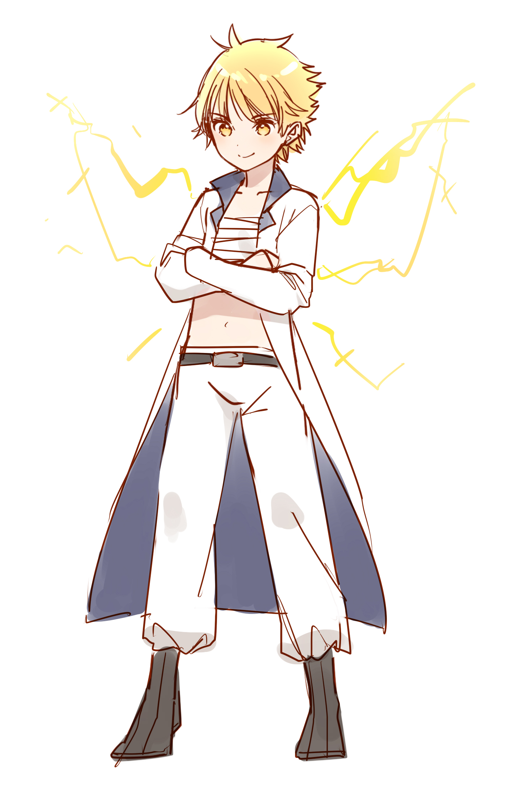

#精霊

##### [親ページに戻る](../README.md)
└精霊

|属性|名前|契約者|一人称||
|:---:|:---:|:---:|:---:|:---:|
|||||
|風|風精霊|セイジ、アヤ|わたし|
|水|水精霊|セイジ、エレナ|私～|
|土|土精霊|セイジ|オレ|
|火|火精霊|セイジ、ヒルダ|あたし|
|||||
|雷|雷精霊|セイジ|あたい|
|氷|氷精霊|セイジ、エレナ|私|
|闇|闇精霊|セイジ|私|
|光|光精霊| | |
|||||
|肉体強化|？？？| | |
|情報|オラクルちゃん|セイジ|私|
|回復|？？？|エレナ| |
|時空|トキ|セイジ|私|

